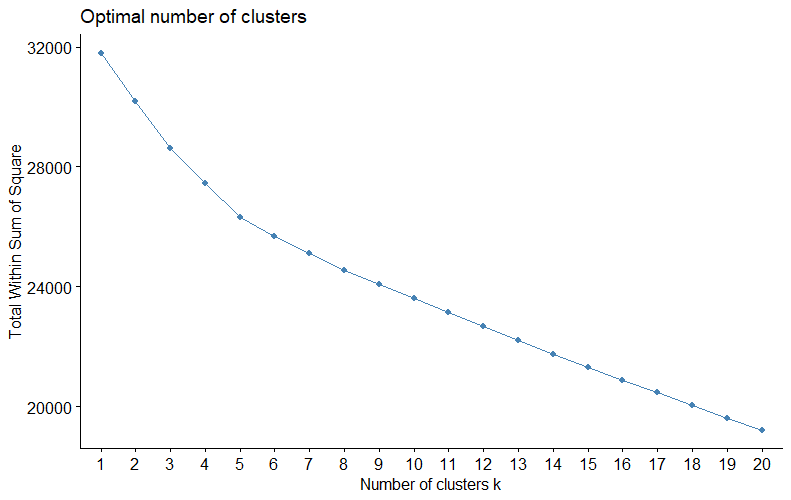
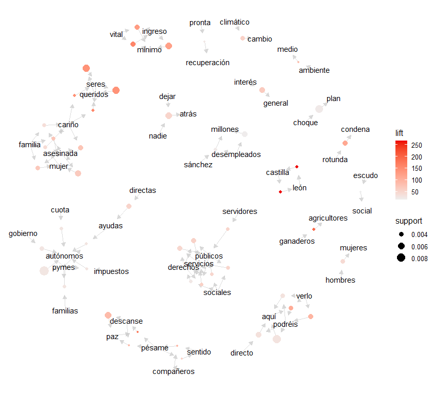
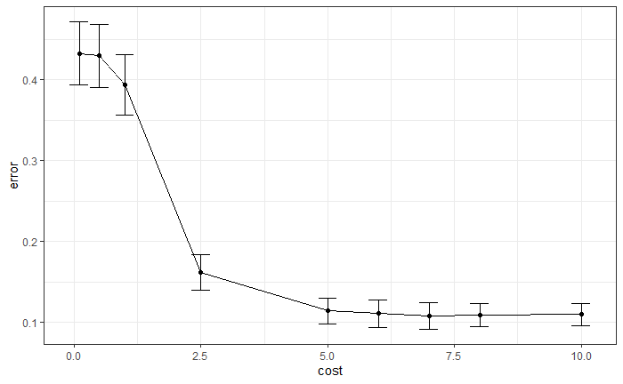
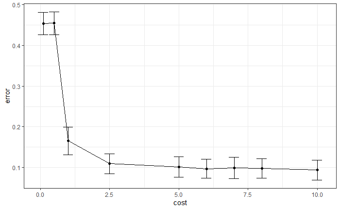

# Definición de la estructura del código

En este cuaderno, se incluye el código necesario para la realización de extracción de tweets y su posterior estudio. Para ello, se divide el cuaderno en los siguientes apartados:

1. Obtención de datos en Twitter e instalación de paquetes necesarios
2. Limpieza y tokenización
3. Análisis exploratorio
    1. Distribución temporal de tweets
    2. Distribución de palabras
        1. Total de palabras utilizadas por cada usuario
        2. Palabras distintas utilizadas por cada usuario
        3. Distribución de las palabras en los tweets por usuario
        4. Palabras más utilizadas por usuario y stop words
        5. Word clouds
        6. N-gramas
            1. Bigramas
            2. Trigramas
            3. Representación
    3. Frecuencia de términos y frecuencia inversa de documentos
        1. Frecuencia de términos
        2. Frecuencia inversa de documentos
4. Clústering
    1. Clústering jerárquico de palabras
    2. Clústering no jerárquico k-medias
5. Reglas de asociación
    1. Evaluación
        1. Soporte y confianza
        2. Búsqueda de conjuntos de ítems frecuentes
        3. Obtención de reglas
        4. Evaluación con test exacto de Fisher
        5. Visualización
6. Clasificación de tweets
    1. Separación de datos
    2. Modelo SVM lineal
7. Análisis de sentimientos
    1. Visualización de los resultados
    2. Recuento de palabras con cada emoción
    3. Nube de sentimientos
    4. Evolución de emociones
    


# Obtención de datos en Twitter e instalación de paquetes necesarios

Para la obtención de datos en Twitter debemos seguir una serie de pasos. En primer lugar tenemos que crear una aplicación de Twitter, y para ello debemos tener una cuenta de desarrollador. Una vez conseguida, creamos la aplicación y seguimos los pasos ofrecidos en https://cran.r-project.org/web/packages/rtweet/vignettes/auth.html, en la que tenemos que crear una API.

Una vez creada, tenemos dos métodos de autorización explicados en el link mencionado, en este caso se va a utilizar la autenticación basada en navegador.

Para ello, es necesario instalar el paquete httpuv:

```{r}
## Instalar httpuv si no lo está
if (!requireNamespace("httpuv", quietly = TRUE)) {
  install.packages("httpuv")
}
```

Y procedemos a crear el token junto con la carga de las librerías necesarias a lo largo de este cuaderno (más adelante se incluirán otras específicas):

```{r}
library(tidyverse)
library(tidyr)
library(knitr)
library(tidytext)
library(lubridate)
library(tm)
library(rtweet)
library(twitteR)

# Almacenamiento de api keys
api_key <- "SP5j6R6eMnM57MnqOTeZHfiNl"
api_secret_key <- "ZzXp0kx4ScyOcQzQJctk5iojAqzs3njG5hS47sFgdwOO3g9Vd3"

# Identificación vía navegador web
twitter_token <- create_token(app = "finalWorkOnTextMining", consumer_key = api_key, consumer_secret = api_secret_key)

# Vemos el token creado
twitter_token

# <Token>
# <oauth_endpoint>
#  request:   https://api.twitter.com/oauth/request_token
#  authorize: https://api.twitter.com/oauth/authenticate
#  access:    https://api.twitter.com/oauth/access_token
# <oauth_app> finalWorkOnTextMining
#   key:    SP5j6R6eMnM57MnqOTeZHfiNl
#   secret: <hidden>
# <credentials> oauth_token, oauth_token_secret, user_id, screen_name
# ---
  
    
```
Para ver que todo funciona correctamente sesión tras sesión:
```{r}
get_token()
```
Llegados a este punto, es momento de crear una función que se encargará de extraer los tweets. Esta función extrae los tweets publicados que hacen referencia a una cuenta y los almacena en un fichero csv. Cabe resaltar que Twitter nos permite extraer un máximo de 3200 tweets, por ello si no se introduce el número máximo de tweets a extraer, se tomará por defecto este mismo número. 

```{r}
# cuenta: cuenta a la que se extraerán tweets
# tweetsmax: número de tweets que se obtendrán
# output_file_name: nombre del fichero de salida. En caso de no especificarse, se crea un nombre por defecto.
extraccion_tweets <- function(cuenta, tweetsmax = 3200, output_file_name = NULL){
  if(is.null(output_file_name)){
    output_file_name <- paste0("datos_tweets_", cuenta,".csv")
  }
  
  if(tweetsmax <= 3200 && tweetsmax >= 1){
    datos_nuevos <- get_timeline(user = cuenta, n = tweetsmax, parse = TRUE, check = TRUE, include_rts = FALSE)
    write_as_csv(datos_nuevos, output_file_name, TRUE)
    print("Nuevo fichero creado")
  }else{
    print("Número máximo de tweets a extraer erróneo. Introduzca un número del 1 al 3200")
  }
  
}
```

Tras haber hecho un previo estudio sobre los tweets publicados por parte de diferentes entidades políticas, se ha observado y decidido extraer tweets sobre los representantes de 4 partidos partidos políticos, obteniendo así un número aceptable de tweets por cada cuenta. Estos políticos son Pablo Iglesias, Inés Arrimadas, Pedro Sánchez y Pablo Casado.
Como para este estudio la cantidad de tweets que recogeremos es suficiente, simplemente llamamos a la funcion con las cuentas de las que se van a extraer los tweets y seleccionamos el número máximo posible:
```{r}
extraccion_tweets("@sanchezcastejon", 3200)
extraccion_tweets("@PabloIglesias", 3200)
extraccion_tweets("@pablocasado_", 3200)
extraccion_tweets("@InesArrimadas",3200)
``` 

Ahora tenemos todos los tweets extraídos en un archivo con formato .csv. Es momento de unirlos para poder estudiarlos:
```{r}
tweets_sanchez <- read_twitter_csv("./datos_tweets_@sanchezcastejon.csv")
tweets_iglesias <- read_twitter_csv("./datos_tweets_@PabloIglesias.csv")
tweets_casado <- read_twitter_csv("./datos_tweets_@pablocasado_.csv")
tweets_arrimadas <- read_twitter_csv("./datos_tweets_@InesArrimadas.csv")

tweets <- bind_rows (tweets_sanchez, tweets_iglesias, tweets_casado, tweets_arrimadas)

tweets %>% group_by(screen_name) %>% summarise(numero_tweets = n())

# A tibble: 4 x 2
#  screen_name     numero_tweets
#  <chr>                   <int>
#1 InesArrimadas            1678
#2 pablocasado_             2201
#3 PabloIglesias            2049
#4 sanchezcastejon          1734

```

Y observamos que, como se ha comentado, el número de tweets obtenidos por usuarios es suficiente para nuestro estudio.

# Limpieza de texto y tokenización

De toda la información disponible, para realizar el análisis exploratorio de los datos nos vamos a quedar solo con algunas de las columnas y renombramos las variables:

```{r}
tweets <- tweets %>% select(screen_name, created_at, status_id, text)

tweets <- tweets %>% rename(usuario = screen_name, fecha = created_at, texto = text, tweet_id = status_id)
```

Es frecuente que en la información recogida en formato textual haya fallos de escritura, por lo que es necesario realizar una limpieza del texto para su posterior tokenización. El proceso de tokenizar un texto consiste en separar el mismo en subdivisiones que lo forman. Estos son los elementos más sencillos con significado propio para el análisis con palabras. Para ello, contamos con varias funciones ya creadas en librerías como *tokenizers*, pero vamos a crear una pequeña función propia que limpia y tokeniza un texto dado como argumento. Cabe destacar que es conveniente primero limpiar el texto para luego tokenizarlo, tal y como se muestra. Mencionar también que no se hace *stemming* porque, al ser una función programada en inglés, los resultados que obtenemos no son apropiados para nuestro estudio.


```{r}
limpia_y_tokeniza <- function(texto){
  new_text <- tolower(texto)
  new_text <- str_replace_all(new_text,"http\\S*", "") #Se suprime los enlaces
  new_text <- str_replace_all(new_text, "<u[^ ]*>","") #Se suprimen iconos
  new_text <- removePunctuation(new_text) 
  new_text <- str_replace_all(new_text, "¡", "") #removePunctuation no elimina "¡"
  new_text <- str_replace_all(new_text, "–", "") #removePunctuation no elimina "-"
  new_text <- str_replace_all(new_text, "¿", "") #removePunctuation no elimina "¿"
  new_text <- str_replace_all(new_text, "‘", "") #removePunctuation no elimina "‘"
  new_text <- str_replace_all(new_text, "’", "") #removePunctuation no elimina "’"
  new_text <- str_replace_all(new_text, "“", "") #removePunctuation no elimina "“"
  new_text <- str_replace_all(new_text, "”", "") #removePunctuation no elimina "”"
  new_text <- str_replace_all(new_text, "€", "") #removePunctuation no elimina "€"
  new_text <- str_replace_all(new_text, "«", "") #removePunctuation no elimina "«"
  new_text <- str_replace_all(new_text, "»", "") #removePunctuation no elimina "»"
  new_text <- str_replace_all(new_text, "°", "") #removePunctuation no elimina "°"
  new_text <- str_replace_all(new_text, "ª", "") #removePunctuation no elimina "ª"
  new_text <- str_replace_all(new_text, "º", "") #removePunctuation no elimina "º"
  new_text <- removeNumbers(new_text)
  new_text <- stripWhitespace(new_text)
  new_text <- str_split(new_text, " ")[[1]] #Tokenización
  new_text <- keep(.x = new_text, .p = function(x){str_length(x) > 1}) #Se suprimen tokens con longitud <= 1
  return(new_text) 
}
```

Aplicamos entonces la función creada a cada tweet recogido.

```{r}
tweets <- tweets %>% mutate(texto_tokenizado = map(.x = texto, .f = limpia_y_tokeniza))

tweets %>% select(texto_tokenizado) %>% head()

# A tibble: 6 x 1
#  texto_tokenizado
#  <list>          
#1 <chr [36]>      
#2 <chr [42]>      
#3 <chr [48]>      
#4 <chr [43]>      
#5 <chr [40]>      
#6 <chr [35]>    
```

# Análisis exploratorio

Tras haber hecho la limpieza y tokenización de los datos, ahora tenemos que cada objeto de estudio es un vector de palabras, de forma que no es lo que se conoce como *tidy data*, en la que una observación es una fila. Para tener la estructura deseada, hacemos uso del procedimiento conocido como *unnest*, el cual se encarga de expander cada lista de tokens, duplicando el valor de las otras columnas tantas veces como sea necesario, tal y como se muestra a continuación.

```{r}
tweets_ordenados <- tweets %>% select(-texto) %>% unnest(cols=c(texto_tokenizado))
tweets_ordenados <- tweets_ordenados %>% rename(token = texto_tokenizado)
head(tweets_ordenados)
# A tibble: 6 x 4
#  usuario         fecha               tweet_id            token    
#  <chr>           <chr>               <chr>               <chr>    
#1 sanchezcastejon 2021-08-15 07:48:58 1426813150653997058 atento   
#2 sanchezcastejon 2021-08-15 07:48:58 1426813150653997058 también  
#3 sanchezcastejon 2021-08-15 07:48:58 1426813150653997058 la       
#4 sanchezcastejon 2021-08-15 07:48:58 1426813150653997058 situación
#5 sanchezcastejon 2021-08-15 07:48:58 1426813150653997058 del      
#6 sanchezcastejon 2021-08-15 07:48:58 1426813150653997058 ifazuébar
```

Teniendo los datos de esta forma, podemos pasar a hacer filtros, sumatorios y representaciones de los datos de una manera más fácil.

## Distribución temporal de tweets

Cada usuario que estudiamos puede haber comenzado su actividad en Twitter en distintos puntos temporales, por lo que es interesante ver si los tweets se superponen en tiempo.

```{r}
ggplot(tweets, aes(x = as.Date(fecha), fill = usuario)) + 
  geom_histogram(position = "identity", bins = 20, show.legend = FALSE) +
  scale_x_date(date_labels = "%m-%Y", date_breaks = "5 month") +
  labs(x = "Fecha de publicación", y = "Número de tweets") +
  facet_wrap(~ usuario, ncol = 1) +
  theme_bw() +
  theme(axis.text.x = element_text(angle = 90))
```


```{r}
tweets_mes_anio <- tweets %>% mutate(mes_anio = format(as.Date(fecha), "%Y-%m")) 
tweets_mes_anio %>% group_by(usuario, mes_anio) %>% summarise(n = n()) %>% 
  ggplot(aes(x = mes_anio, y = n, color = usuario)) + 
  geom_line(aes(group = usuario)) + 
  labs(title = "Número de tweets publicados", x = "Fecha de publicación", y = "Número de tweets") + 
  theme_bw() + 
  theme(axis.text.x = element_text(angle = 90, size = 6), legend.position = "bottom")
```


Podemos observar que el usuario *pablocasado_* y *sanchezcastejon* tienen una actividad similar en el periodo estudiado, mientras que la actividad de *PabloIglesias* es irregular a lo largo del tiempo, llegando a tener hasta 200 tweets en meses como octubre de 2019 y abril de 2021, o superando los 150 tweets en julio del pasado verano. Estos "picos" se deben a momentos importantes en la vida del político como las elecciones generales o de Madrid. En el caso de *InesArrimadas*, podemos observar que su actividad se puede asimilar a la de las dos primeras cuentas mencionadas, pero con una clara decadencia de tweets en el mes de junio de 2020, ya que dio a luz.

## Distribución de palabras

Para hacer un estudio de cada usuario, puede ser interesante estudiar con qué frecuencia utilizan qué palabras, por ello vamos a proceder como se muestra en los próximos apartados.

### Total de palabras utilizadas por cada usuario

```{r}
tweets_ordenados %>% group_by(usuario) %>% summarise(n=n())

# # A tibble: 4 x 2
#   usuario             n
#   <chr>           <int>
# 1 InesArrimadas   60499
# 2 pablocasado_    87365
# 3 PabloIglesias   59271
# 4 sanchezcastejon 67830

```
Podemos obervar como el número de palabras de cada usuario es similar, a excepción del usuario *pablocasado_*, con una diferencia considerable de hasta 20000 palabras, lo que podría llevarnos a pensar que sus tweets son más largos, pero no deja de ser una mera suposición. Vamos a verlo gráficamente.

```{r}
tweets_ordenados %>% ggplot(aes(x=usuario)) + geom_bar() + coord_flip() + theme_bw()
```


### Palabras distintas utilizadas por cada usuario

Acabamos de ver el número de palabras utilizadas total por cada usuario, pero podemos encontrar interesante estudiar cuántas de ellas son distintas. Para ello:

```{r}
tweets_ordenados %>% select(usuario, token) %>% distinct() %>% group_by(usuario) %>% summarise(palabras_distintas=n())

# # A tibble: 4 x 2
#   usuario         palabras_distintas
#   <chr>                        <int>
# 1 InesArrimadas                 7999
# 2 pablocasado_                 10092
# 3 PabloIglesias                 9498
# 4 sanchezcastejon               8949

```
Y vemos de nuevo que *pablocasado_* destaca por usar más palabras distintas, pero en este caso no se desmarca con una cantidad tan grande, ya que le sigue *PabloIglesias* con 10092 palabras distintas. Lo vemos gráficamente:

```{r}
tweets_ordenados %>% select(usuario,token) %>% distinct() %>% ggplot(aes(x=usuario)) + geom_bar() + coord_flip() + theme_bw()
```


### Distribución temporal de los tweets por usuario

En este apartado se representan las longitudes de los tweets por usuario en un gráfico de cajas y bigotes para ver la distribución de los datos.


```{r}
whisker <- tweets_ordenados %>% group_by(usuario, tweet_id) %>% summarise(longitud=n()) %>% group_by(usuario) %>% select(-tweet_id) 
boxplot(whisker$longitud ~ whisker$usuario)
```


Sorprenden los resultados de los tweets de *PabloIglesias*, ya que su media es más baja que el resto de usuarios y la desviación típica es relativamente alta, lo que significa que sus tweets podrían ser cortos o largos. Sin embargo, podemos decir que el resto de cuentas se comportan de una manera similar. Representamos estos resultados en una barra de error para ver la variabilidad de los datos.


### Palabras más utilizadas por usuario y stop words

Pasamos ahora a estudiar cuáles son las palabras que más utilizan los usuarios que estamos estudiando.
```{r}
tweets_ordenados %>% group_by(usuario, token) %>% count(token) %>% group_by(usuario) %>% top_n(5, n) %>% arrange(usuario, desc(n)) %>% print(n=20)

# # A tibble: 20 x 3
# # Groups:   usuario [4]
#    usuario         token     n
#    <chr>           <chr> <int>
#  1 InesArrimadas   de     3422
#  2 InesArrimadas   la     2415
#  3 InesArrimadas   que    1759
#  4 InesArrimadas   el     1726
#  5 InesArrimadas   en     1591
#  6 pablocasado_    de     5370
#  7 pablocasado_    la     4209
#  8 pablocasado_    el     3032
#  9 pablocasado_    que    2534
# 10 pablocasado_    en     2116
# 11 PabloIglesias   de     3507
# 12 PabloIglesias   la     2712
# 13 PabloIglesias   que    1998
# 14 PabloIglesias   el     1640
# 15 PabloIglesias   en     1614
# 16 sanchezcastejon de     3710
# 17 sanchezcastejon la     3627
# 18 sanchezcastejon el     2177
# 19 sanchezcastejon en     1841
# 20 sanchezcastejon que    1428
```

Podemos observar que las palabras más utilizadas carecen de sentido. Es en este momento donde debemos hacer uso de las *stop words*, palabras que vamos a eliminar ya que no aportan información por sí mismas. Como nuestro estudio es en español, tenemos que buscar una librería que tenga un listado de estas palabras en nuestro idioma, o en su defecto, crear nosotros mismos uno. En este caso vamos a hacer uso de la librería *tm*, que nos proporciona una lista almacenada en el fichero *stopwords.txt* que se utilizarán en el estudio. Procedemos entonces a buscar de nuevo las palabras más utilizadas y representarlas en un diagrama de barras.

```{r}
tweets_ordenados <- tweets_ordenados %>% filter(!(token %in% stopwords("spanish"))) %>% filter(!(token %in% stopwords()))
tweets_ordenados %>% group_by(usuario, token) %>% count(token) %>% group_by(usuario) %>% top_n(5, n) %>% arrange(usuario, desc(n)) %>% print(n=20)

# # A tibble: 20 x 3
# # Groups:   usuario [4]
#    usuario         token            n
#    <chr>           <chr>        <int>
#  1 InesArrimadas   gobierno       387
#  2 InesArrimadas   españa         365
#  3 InesArrimadas   hoy            254
#  4 InesArrimadas   sánchez        219
#  5 InesArrimadas   gracias        207
#  6 pablocasado_    sánchez        914
#  7 pablocasado_    gobierno       652
#  8 pablocasado_    españa         478
#  9 pablocasado_    pp             361
# 10 pablocasado_    hoy            284
# 11 PabloIglesias   gobierno       256
# 12 PabloIglesias   hoy            246
# 13 PabloIglesias   españa         245
# 14 PabloIglesias   derechos       174
# 15 PabloIglesias   social         155
# 16 sanchezcastejon españa         512
# 17 sanchezcastejon hoy            406
# 18 sanchezcastejon país           287
# 19 sanchezcastejon gobierno       273
# 20 sanchezcastejon recuperación   214

tweets_ordenados %>% group_by(usuario, token) %>% count(token) %>% group_by(usuario) %>% top_n(10, n) %>% arrange(usuario, desc(n)) %>% ggplot(aes(x = reorder(token,n), y = n, fill = usuario)) + geom_col() + theme_bw() + labs(y = "", x = "") + theme(legend.position = "none") + coord_flip() + facet_wrap(~usuario,scales = "free", ncol = 1, drop = TRUE)


```


Podemos darle sentido a estos resultados de palabras teniendo en cuenta que el usuario *sanchezcastejon* es el actual presidente de España, por lo que no es descabellado que sus palabras más utilizadas sean "españa", "gobierno", "hoy" o "país". En el caso del usuario *PabloIglesias*, antiguo vicepresidente del Gobierno y ex-político de Unidas podemos, no sorprende que dentro de sus palabras más repetidas se encuentren "social" o "derechos". En cuanto a los usuarios *InesArrimadas* y *pablocasado_* podemos encontrar la palabra "sánchez" dentro de las más usadas, ésto también cobra sentido pues son usuarios que pertenecen a otros partidos políticos que no gobiernan actualmente en España.

### Word clouds

Otra forma de representar lo que estamos estudiando es, por ejemplo, con el uso de las llamadas *word clouds*, un gráfico en el que las palabras más importantes son de mayor tamaño y van decreciendo en función a su importancia. Para ello, debemos hacer uso de la librería *wordcloud*. Como tenemos varios usuarios, vamos a crear una función que muestre al usuario, junto con su nube de palabras, de forma que en cada una de ellas no habrá más de 200 palabras.

```{r}
library(wordcloud)
library(RColorBrewer)
library(Rcpp)

wordcloud_custom <- function(grupo, df){ 
  print(grupo) 
  wordcloud(words = df$token, freq = df$frecuencia, max.words = 200, random.order = FALSE, rot.per = 0.35, colors = brewer.pal(8, "Dark2")) 
} 

df_grouped <- tweets_ordenados %>% group_by(usuario, token) %>% count(token) %>% group_by(usuario) %>% mutate(frecuencia = n / n()) %>% arrange(usuario, desc(frecuencia)) %>% nest() 

walk2(.x = df_grouped$usuario, .y = df_grouped$data, .f = wordcloud_custom)

```
Como resultado obtenemos:

[1] "InesArrimadas"


[1] "pablocasado_"


[1] "PabloIglesias"


[1] "sanchezcastejon"


### N-gramas

Puede ser interesante estudiar si existe alguna relación entre las palabras de los tweets con las que estamos trabajando. Más adelante, dentro de las técnicas estadísticas aplicadas, aplicamos las reglas de asociación, técnica que se encarga de estudiar qué palabras o conjunto de palabras tienden a coexistir en los mismos documentos(tweets). En este caso, vamos a utilizar los n-gramas para estudiar qué palabras tienden a seguir a otras inmediatamente después.

En secciones anteriores, hemos hecho uso de la función *unnest* para tokenizar por palabras, pero también podemos usarla para tokenizar en secuencias consecutivas de palabras, lo que se conoce como n-gramas. Al estudiar con qué frecuencia una palabra va seguida de otra distinta, podemos construir un modelo de las relaciones entre ellas.

#### Bigramas

Podemos comenzar creando lo que se conoce como *bigramas* sobre estos tweets para examinar los pares de **dos** palabras que son consecutivas. 

```{r}
bigrama_tweets <- tweets %>% unnest_tokens(bigrama, texto, token = "ngrams", n=2)

```

Esta estructura nueva creada en la columna "bigrama" no es mas que una "variación del formato de texto" de cada tweet. Vamos a mostrar los bigramas más comunes:

```{r}
bigrama_tweets %>% count(bigrama, sort = TRUE)

# # A tibble: 131,218 x 2
#    bigrama         n
#    <chr>       <int>
#  1 https t.co   6899
#  2 de la        2297
#  3 a la         1309
#  4 a los        1108
#  5 en el        1019
#  6 de los        998
#  7 en la         955
#  8 y la          900
#  9 u 0001f447    844
# 10 el gobierno   709
```

Como estos datos no los hemos limpiado y tokenizado, es normal que aparezcan estos pares de palabras juntos como más usados. Por ello, vamos a crear una función que se encargue de solo limpiar el texto, para luego separar cada par de palabras en dos: "palabra1" y "palabra2", eliminando los casos en los que cualquiera de las dos sea una *stop word* y eliminarla, tal y como se muestra a continuación.

```{r}
#Creamos una función que solo limpie el texto, para luego nosotros crear el bigrama
limpiar <- function(texto){
  new_text <- tolower(texto)
  new_text <- str_replace_all(new_text,"http\\S*", "") #Se suprime los enlaces
  new_text <- str_replace_all(new_text, "<u[^ ]*>","") #Se suprimen iconos
  new_text <- removePunctuation(new_text)
  new_text <- str_replace_all(new_text, "¡", "") #removePunctuation no elimina "¡"
  new_text <- str_replace_all(new_text, "–", "") #removePunctuation no elimina "-"
  new_text <- str_replace_all(new_text, "¿", "") #removePunctuation no elimina "¿"
  new_text <- str_replace_all(new_text, "‘", "") #removePunctuation no elimina "‘"
  new_text <- str_replace_all(new_text, "’", "") #removePunctuation no elimina "’"
  new_text <- str_replace_all(new_text, "“", "") #removePunctuation no elimina "“"
  new_text <- str_replace_all(new_text, "”", "") #removePunctuation no elimina "”"
  new_text <- str_replace_all(new_text, "€", "") #removePunctuation no elimina "€"
  new_text <- str_replace_all(new_text, "«", "") #removePunctuation no elimina "«"
  new_text <- str_replace_all(new_text, "»", "") #removePunctuation no elimina "»"
  new_text <- str_replace_all(new_text, "°", "") #removePunctuation no elimina "°"
  new_text <- str_replace_all(new_text, "ª", "") #removePunctuation no elimina "ª"
  new_text <- str_replace_all(new_text, "º", "") #removePunctuation no elimina "º"
  new_text <- removeNumbers(new_text)
  new_text <- stripWhitespace(new_text)
  return(new_text)
}

#Aplicamos la función a los tweets
tweets_limpios <- tweets %>% mutate(texto_limpio = map(.x = texto, .f = limpiar))

#Volvemos a ejecutar el código para obtener las palabras
bigrama_tweets <- tweets_limpios %>% unnest_tokens(bigrama, texto_limpio, token = "ngrams", n=2)

#Los mostramos
bigrama_tweets %>% count(bigrama, sort = TRUE)

# # A tibble: 116,676 x 2
#    bigrama         n
#    <chr>       <int>
#  1 de la        2302
#  2 a la         1310
#  3 a los        1109
#  4 en el        1022
#  5 de los        998
#  6 en la         957
#  7 y la          902
#  8 el gobierno   709
#  9 a las         570
# 10 de las        569
# # ... with 116,666 more rows

bigramas_separados <- bigrama_tweets %>% separate(bigrama, c("palabra1", "palabra2"), sep=" ")

bigramas_sin_stopwords <- bigramas_separados %>% filter(!palabra1 %in% stopwords("spanish")) %>% filter(!palabra2 %in% stopwords("spanish")) %>% filter(!palabra1 %in% stopwords()) %>% filter(!palabra2 %in% stopwords()) %>% na.omit()

bigrama_tweets_limpios <- bigramas_sin_stopwords %>% count(palabra1, palabra2, sort=TRUE)

bigrama_tweets_limpios

# # A tibble: 37,708 x 3
#    palabra1   palabra2       n
#    <chr>      <chr>      <int>
#  1 muchas     gracias       96
#  2 hace       años          95
#  3 sánchez    debe          82
#  4 justicia   social        79
#  5 derechos   sociales      77
#  6 servicios  públicos      75
#  7 toda       españa        75
#  8 fondos     europeos      68
#  9 gobierno   debe          66
# 10 seguiremos trabajando    66
# # ... with 37,698 more rows


#Unimos las palabras para tratarlas como un único token
bigrama_tweets_limpios <- bigramas_sin_stopwords %>% unite(bigrama, palabra1, palabra2, sep = " ") %>% count(bigrama, sort=TRUE)

```

#### Trigramas

En este caso, para buscar los trigramas, vamos a seguir los mismos pasos descritos en la sección anterior, pero en este caso, n será 3.

```{r}
trigrama_tweets <- tweets_limpios %>% unnest_tokens(trigrama, texto_limpio, token = "ngrams", n=3)

#Los mostramos
trigrama_tweets %>% count(trigrama, sort = TRUE)

# # A tibble: 208,926 x 2
#    trigrama             n
#    <chr>            <int>
#  1 NA                 192
#  2 a todos los        154
#  3 estado de alarma   144
#  4 el gobierno de     128
#  5 todo mi apoyo      114
#  6 en el congreso     107
#  7 el estado de       104
#  8 a las familias     103
#  9 de la ue            99
# 10 de nuestro país     97
# # ... with 208,916 more rows

trigramas_separados <- trigrama_tweets %>% separate(trigrama, c("palabra1", "palabra2", "palabra3"), sep=" ")

trigramas_sin_stopwords <- trigramas_separados %>% filter(!palabra1 %in% stopwords("spanish")) %>% filter(!palabra2 %in% stopwords("spanish")) %>% filter(!palabra3 %in% stopwords("spanish")) %>% filter(!palabra1 %in% stopwords()) %>% filter(!palabra2 %in% stopwords()) %>% filter(!palabra3 %in% stopwords()) %>% na.omit()

trigrama_tweets_limpios <- trigramas_sin_stopwords %>% count(palabra1, palabra2, palabra3, sort=TRUE)

trigrama_tweets_limpios

# # A tibble: 15,991 x 4
#    palabra1   palabra2   palabra3       n
#    <chr>      <chr>      <chr>      <int>
#  1 ingreso    mínimo     vital         35
#  2 hoy        hace       años          18
#  3 miguel     ángel      blanco        15
#  4 hace       años       eta           13
#  5 seguiremos trabajando juntos        13
#  6 podréis    verlo      aquí          12
#  7 nadie      quede      atrás         11
#  8 año        tan        difícil        9
#  9 años       eta        asesinó        9
# 10 debemos    seguir     trabajando     8
# # ... with 15,965 more rows

trigrama_tweets_limpios <- trigramas_sin_stopwords %>% unite(trigrama, palabra1, palabra2, palabra3, sep = " ") %>% count(trigrama, sort=TRUE)

```


#### Representación

Podemos representar los resultados obtenidos en los bigramas y trigramas de diferentes formas. Primero se puede hacer uso de la recién utilizada *word cloud*, tal y como se muestra a continuación.

```{r}
wordcloud(words = bigrama_tweets_limpios$bigrama, freq = bigrama_tweets_limpios$n, max.words = 200, random.order = FALSE, rot.per = 0.35, colors = brewer.pal(8, "Dark2"))
```


```{r}
wordcloud(words = trigrama_tweets_limpios$trigrama, freq = trigrama_tweets_limpios$n, max.words = 200, random.order = FALSE, rot.per = 0.35, colors = brewer.pal(8, "Dark2"))
```


Otra posible forma de representar estos mismos resultados es a través de un diagrama de barras, tal y como se muestra.

```{r}
bigrama_tweets_limpios %>% top_n(10, n) %>% arrange(bigrama, n) %>% ggplot(aes(x=bigrama, y=n)) + geom_col() + coord_flip() + theme_bw()
```


```{r}
trigrama_tweets_limpios %>% top_n(10, n) %>% arrange(trigrama, n) %>% ggplot(aes(x=trigrama, y=n)) + geom_col() + coord_flip() + theme_bw()
```


## Frecuencia de términos y frecuencia inversa de documentos

Podemos ahora estudiar la importancia de ciertos términos en función a la frecuencia con la que aparecen. Sin embargo, puede ser que los resultados obtenidos solo a partir de la frecuencia no sean tan relevantes en el ámbito en el que lo estemos estudiando, por lo que se recurre al método de la frecuencia inversa, en el cual se multiplica el valor de la frecuencia de cada término por la inversa de la misma. De este modo, se reduce la importancia de los términos repetidos muchas veces que no aportan información útil.

### Frecuencia de términos (Term frecuency)

Para calcular la frecuencia de cada término en nuestro estudio, tenemos que buscar primero el número de veces que aparece cada término por tweet, para luego añadirle una columna con el total de términos por tweet y acabar calculando lo que buscamos en esta sección (lo denotaremos *tf* por su nombre en inglés), tal y como se muestra en el código.

```{r}
tweets_tf <- tweets_ordenados %>% group_by(tweet_id, token) %>% summarise(n=n())

tweets_tf <- tweets_tf %>% mutate(total_n = sum(n))

tweets_tf <- tweets_tf %>% mutate(tf = n/total_n)
head(tweets_tf)

# # A tibble: 6 x 5
# # Groups:   tweet_id [2]
#   tweet_id            token            n total_n     tf
#   <chr>               <chr>        <int>   <int>  <dbl>
# 1 1164445168646467584 feminoacid       1       3 0.333 
# 2 1164445168646467584 fuertecito       1       3 0.333 
# 3 1164445168646467584 respiro          1       3 0.333 
# 4 1164865703301865472 accionariado     1      23 0.0435
# 5 1164865703301865472 airbnb           1      23 0.0435
# 6 1164865703301865472 antonio          1      23 0.0435
```

### Frecuencia inversa de documentos (Inverse Documents Frecuency)

En este apartado, para obtener la frecuencia inversa de documentos, vamos a obtener en primer lugar el número total de documentos que tenemos para, en segundo lugar, buscar el número de documentos en los que aparece cada término y acabar calculando la frecuencia inversa (denotada por *idf* por su nombre en inglés).

```{r}
documentos_total = tweets_ordenados$tweet_id %>% unique() %>% length()
documentos_total # [1] 7595

tweets_idf <- tweets_ordenados %>% distinct(token, tweet_id) %>% group_by(token) %>% summarise(n_documentos = n())

tweets_idf <- tweets_idf %>% mutate(idf = n_documentos / documentos_total) %>% arrange(desc(idf))
head(tweets_idf)

# # A tibble: 6 x 3
#   token    n_documentos    idf
#   <chr>           <int>  <dbl>
# 1 españa           1525 0.201 
# 2 gobierno         1492 0.196 
# 3 hoy              1159 0.153 
# 4 sánchez          1121 0.148 
# 5 país              619 0.0815
# 6 gracias           545 0.0718

```


Podemos ahora hacer una tabla en la que aparezcan ambas frecuencias.

```{r}
tweets_tf_idf <- left_join(x=tweets_tf, y=tweets_idf, by="token") %>% ungroup()
tweets_tf_idf <- tweets_tf_idf %>% mutate(tf_idf = tf * idf)
tweets_tf_idf %>% select(-tweet_id) %>% head()
# # A tibble: 6 x 7
#   token            n total_n     tf n_documentos      idf     tf_idf
#   <chr>        <int>   <int>  <dbl>        <int>    <dbl>      <dbl>
# 1 feminoacid       1       3 0.333             1 0.000132 0.0000439 
# 2 fuertecito       1       3 0.333             1 0.000132 0.0000439 
# 3 respiro          1       3 0.333             2 0.000263 0.0000878 
# 4 accionariado     1      23 0.0435            1 0.000132 0.00000572
# 5 airbnb           1      23 0.0435            1 0.000132 0.00000572
# 6 antonio          1      23 0.0435           18 0.00237  0.000103 

```

Y entonces vemos que para el primer tweet, los tres primeros términos que aparecen una vez tienen la misma frecuencia, pero distinta frecuencia inversa, ya que no todos los términos aparecen con la misma frecuencia en el conjunto de todos los tweets. Del mismo modo ocurre con los otros dos términos.


# Clustering

Tras hacer este análisis exploratorio y pasar a la siguiente sección en la que se aplican técnicas estadísticas a los datos, necesitamos hacer una representación numérica de estos, en el que se podría usar el valor ya obtenido de *tf-idf* y de forma que estén en lo que se conoce como *term document matrix*, matriz que describe la frecuencia de términos que aparecen en una colección de documentos.

```{r}
corpus <- Corpus(VectorSource(tweets_ordenados$token)) #Usamos tweets_ordenados$token porque ya está libre de stop words

tdm <- TermDocumentMatrix(corpus) #Term document matrix
tdm 

# <<TermDocumentMatrix (terms: 21585, documents: 152077)>>
# Non-/sparse entries: 149974/3282432071
# Sparsity           : 100%
# Maximal term length: 40
# Weighting          : term frequency (tf)
```

Y observamos que tenemos 21585 términos y 152077 documentos. Son demasiados términos para nuestro estudio, así que vamos a quedarnos con menos términos filtrando por el *sparse* (dispersión).

```{r}
t <- removeSparseTerms(tdm, sparse=0.9999)
t
# <<TermDocumentMatrix (terms: 1763, documents: 152077)>>
# Non-/sparse entries: 99022/268012729
# Sparsity           : 100%
# Maximal term length: 24
# Weighting          : term frequency (tf)

t <- removeSparseTerms(tdm, sparse=0.999)
t

# <<TermDocumentMatrix (terms: 103, documents: 152077)>>
# Non-/sparse entries: 32087/15631844
# Sparsity           : 100%
# Maximal term length: 12
# Weighting          : term frequency (tf)

#Para posterior análisis, necesitamos que tenga forma de matriz
m <- as.matrix(t) 

#Filtramos por palabras que aparezcan más de 300 veces
freq <- rowSums(m)
freq <- subset(freq, freq >= 300)
barplot(freq, las=2)
```


## Clústering jerárquico de palabras

Hacemos uso de la función *dist()* para calcular la distancia entre palabras en cada documento. Si la distancia es alta, eso significa que esas dos palabras no deberían estar en el mismo clúster. Del modo opuesto ocurre si la distancia es pequeña. Para hacer el clústering jerárquico, en este caso se va a utilizar el método de *Ward* de varianza mínima; un método jerárquico divisivo, en el cual se utiliza el error de la suma de los cuadrados o la varianza, intentando minimizar éstos para agrupar términos.

```{r}
distance <- dist(scale(m))

hc <- hclust(distance, method = "ward.D")
plot(hc, hang=-1)
```


Y podemos visualizar también cómo podemos separar el dendograma en, por ejemplo, 4 clústeres.


## Clústering no jerárquico k-medias

En este caso vamos a utilizar un método no jerárquico con métodos de reasignación con centroides, como es el método *k-means* o k-medias, un método de agrupamiento que tiene como objetivo la partición de un conjunto de n observaciones en k grupos en el que cada observación pertenece al grupo cuyo valor medio es más cercano. Este método necesita dar el número de clústeres que queremos al llamar a la función. Para elegir el número óptimo y hacer un estudio para elegir el mejor k, optamos por tres métodos: **elbow method** (método del codo), **método Silhouette** y el **estadístico de Gap**.

**Método del codo**

Hacemos uso de la librería *factoextra* que nos proporciona una función *fviz_nbclust* para la aplicación de este método. Al llamar a la función, como método vamos a utilizar "wss", ya que aquí se pretende minimizar la variación total dentro del clúster (total within-cluster sum of square, WSS).

```{r}
library(factoextra)
fviz_nbclust(m, kmeans, method = "wss", k.max = 20)

```


Podemos elegir k=5 como mejor opción para clustering y ver qué porcentaje obtenemos al dividir la suma de los cuadrados entre grupos entre la suma total de cuadrados.

```{r}
kc <- kmeans(m, 5)
kc$betweenss/kc$totss*100 
#17.2%
```

**Método Silhouette**

Este método utiliza la distancia media entre un dato y otros dentro del mismo clúster junto con la distancia entre los diferentes clústeres para medir el resultado final. 

Para utilizarlo, llamamos a la misma función que antes pero con *method="silhouette"*.
```{r}
fviz_nbclust(m, kmeans, method = "silhouette")+labs(subtitle = "Silhouette method")
```


Y nos dice que el número óptimo de clústeres es 2. Mostramos también el porcentaje obtenido.

```{r}
kc <- kmeans(m, 2)
kc$betweenss/kc$totss*100 
#4.995576
```


**Método de Gap**

El método de Gap es un método estadístico que obtiene el número óptimo de clústeres en primer lugar, obteniendo la salida del método de k-medias, para luego comparar el cambio en la dispersión dentro de los clústeres y obtener un número de clústeres apropiado.

Al llamar a la función lo hacemos como *method="gap_stat"*.

```{r}
set.seed(222)
fviz_nbclust(m, kmeans, nstart = 25,  method = "gap_stat", nboot = 50)+  labs(subtitle = "Gap statistic method")

```


Y vemos que la solución que nos da el criterio es de k=1, aunque para k=4 se obtiene casi el mismo resultado.

Es por ello que es necesario hacer una comparación del between_SS/total_SS junto con la suma de cuadrados dentro de cada clúster (withinss) para evaluar cuál podría ser la mejor opción.


```{r}
kc <- kmeans(m,1)
kc$withinss #31775.48
kc$betweenss/kc$tot.withinss*100 #2.085518e-09

kc <- kmeans(m,2)
kc$withinss #0.00 30188.11
kc$betweenss/kc$tot.withinss*100 #5.258256

kc <- kmeans(m,3)
kc$withinss #0.00     0.00 28632.67
kc$betweenss/kc$tot.withinss*100 #10.97628

kc <- kmeans(m,4)
kc$withinss #0.00     0.00 27451.71     0.00
kc$betweenss/kc$tot.withinss*100 #15.75044

kc <- kmeans(m,5)
kc$withinss #26305.58     0.00     0.00     0.00     0.00
kc$betweenss/kc$tot.withinss*100 #20.79369

```

Vemos que teniendo estos tres métodos en cuenta, a medida que aumentamos k, tenemos mejores resultados.

#  Reglas de asociación

Las reglas de asociación se representan con implicaciones de la forma X -> Y, donde X e Y son conjuntos de ítems disjuntos. En esta sección de la experimentación se pretende encontrar estas relaciones de coocurrencia entre los distintos conjuntos de ítems. Para ello, se hace uso de la elección de ciertos parámetros como el soporte y la confianza para la obtención de resultados. Para ello vamos a utilizar el algoritmo Apriori.

## Evaluación

Podemos comenzar viendo cual es la longitud media de los tweets por usuario, junto con su desviación típica, para luego mostrarlo visualmente como transacciones.

```{r}
tweets_ordenados %>% group_by(usuario, tweet_id) %>% summarise(longitud=n()) %>% group_by(usuario) %>% summarise(longitud_media = mean(longitud), dt_longitud = sd(longitud))

# # A tibble: 4 x 3
#   usuario         longitud_media dt_longitud
#   <chr>                    <dbl>       <dbl>
# 1 InesArrimadas             20.1        4.39
# 2 pablocasado_              21.9        4.43
# 3 PabloIglesias             16.3        7.05
# 4 sanchezcastejon           21.9        2.97
```


```{r}
tweets_AR <- tweets_ordenados %>% select(tweet_id, token) #tweets para las reglas de asociación
```

Cada línea o token contiene una sola palabra, por ello hay incluida una columna con el ID del tweet (transacción) al que corresponde cada palabra (token).

```{r}
library(arules)
write.csv(tweets_AR, "tweets_AR.csv", quote=FALSE)

transacciones <- read.transactions(file = "./tweets_AR.csv", header = TRUE, format = "single", sep = ",", cols = c("tweet_id", "token"), rm.duplicates = TRUE)
dim(transacciones) #7595 21670
# Tamaños de todas las transacciones
tamanos_transacciones <- data.frame(tamano = size(transacciones))
ggplot(tamanos_transacciones, aes(x = tamano)) +  geom_density(fill = "orangered3") +  labs(x = "Tamaño de las transacciones") + theme_bw()

```


Como nos interesa saber qué palabras "van juntas", vamos a restringir las transacciones a aquellas que tengan al menos 2 palabras y las representamos.

```{r}
transacciones <- transacciones[tamanos_transacciones > 1]
dim(transacciones) #7504 21670

tamanos_transacciones <- data.frame(tamano = size(transacciones))
ggplot(tamanos_transacciones, aes(x = tamano)) +  geom_density(fill = "orangered3") +  labs(x = "Tamaño de las transacciones") + theme_bw()
```


Lo que ha supuesto una clara reducción de transacciones.

### Soporte y confianza

En este caso tenemos que considerar que nuestros datos son de dimensiones grandes, por lo que el soporte tendrá que ser pequeño al esperar que cada evento sea “poco común”. Por ello se ha ido probando qué valores daban un resultado adecuado, y se ha decidido elegir 0.003 como soporte, lo que significa que se supone frecuente cuando aparece al menos 22 veces. Del mismo modo se ha elegido una confianza del 85%.

```{r}
soporte <- 0.003
confianza <- 0.85
```

### Búsqueda de conjuntos de ítems frecuentes

Hacemos uso de la función *apriori()* dentro de la librería con la que estamos trabajado en esta sección para encontrar los conjuntos de ítems frecuentes.

```{r}
itemsets_frecuentes <- apriori(data = transacciones, parameter = list(support = soporte, target = "frequent itemsets"), control = list(verbose = FALSE))
summary(itemsets_frecuentes)

# set of 2638 itemsets
# 
# most frequent items:
#   españa gobierno  sánchez      hoy     país  (Other) 
#      244      237      178      145       61     3304 
# 
# element (itemset/transaction) length distribution:sizes
#    1    2    3    4 
# 1198 1351   87    2 
# 
#    Min. 1st Qu.  Median    Mean 3rd Qu.    Max. 
#    1.00    1.00    2.00    1.58    2.00    4.00 
# 
# summary of quality measures:
#     support         transIdenticalToItemsets     count        
#  Min.   :0.003065   Min.   :0.0000000        Min.   :  23.00  
#  1st Qu.:0.003598   1st Qu.:0.0000000        1st Qu.:  27.00  
#  Median :0.004531   Median :0.0000000        Median :  34.00  
#  Mean   :0.007253   Mean   :0.0001219        Mean   :  54.43  
#  3rd Qu.:0.007329   3rd Qu.:0.0000000        3rd Qu.:  55.00  
#  Max.   :0.203225   Max.   :0.0126599        Max.   :1525.00  
# 
# includes transaction ID lists: FALSE 
# 
# mining info:

```

Según el output obtenido, podemos ver que hay un total de 2638 conjuntos de ítems frecuentes, que son los que superan el soporte mínimo establecido. Muchos de ellos están formados por 1 y 2 ítems (1198 y 1351 respectivamente).

### Obtención de reglas

Volvemos a hacer uso de la función *apriori()* para obtener las reglas.

```{r}
reglas <- apriori(data = transacciones, parameter = list(support = soporte, confidence = confianza, target = "rules"), control = list(verbose = FALSE))

print(paste("Reglas generadas:", length(reglas))) # [1] "Reglas generadas: 51"

summary(reglas)

# set of 51 rules
# 
# rule length distribution (lhs + rhs):sizes
#  2  3  4 
# 23 23  5 
# 
#    Min. 1st Qu.  Median    Mean 3rd Qu.    Max. 
#   2.000   2.000   3.000   2.647   3.000   4.000 
# 
# summary of quality measures:
#     support           confidence        coverage             lift            count      
#  Min.   :0.003065   Min.   :0.8519   Min.   :0.003065   Min.   : 15.29   Min.   :23.00  
#  1st Qu.:0.003198   1st Qu.:0.8929   1st Qu.:0.003465   1st Qu.: 31.61   1st Qu.:24.00  
#  Median :0.003865   Median :0.9375   Median :0.004131   Median : 55.78   Median :29.00  
#  Mean   :0.004228   Mean   :0.9369   Mean   :0.004539   Mean   : 77.18   Mean   :31.73  
#  3rd Qu.:0.004531   3rd Qu.:0.9718   3rd Qu.:0.004797   3rd Qu.:101.12   3rd Qu.:34.00  
#  Max.   :0.009728   Max.   :1.0000   Max.   :0.011327   Max.   :266.81   Max.   :73.00 

#inspect(reglas)
```

Podemos observar que hemos obtenido 51 reglas, con un lift mínimo de 15, por lo que puede ocurrir que se repitan estos patrones obtenidos.

Podemos obtener también las reglas maximales, que son aquellas que están generadas por conjuntos de ítems maximales. Para ello hacemos uso de la función *is.maximal()*.

```{r}
reglas_maximales <- reglas[is.maximal(reglas)]
reglas_maximales

#      lhs                              rhs            support     confidence coverage    lift      count
# [1]  {pronta}                      => {recuperación} 0.003065032 0.9583333  0.003198294  24.62785 23   
# [2]  {servidores}                  => {públicos}     0.003464819 1.0000000  0.003464819  50.36242 26   
# [3]  {ganaderos}                   => {agricultores} 0.003198294 1.0000000  0.003198294 192.41026 24   
# [4]  {ambiente}                    => {medio}        0.003065032 0.9200000  0.003331557  83.17687 23   
# [5]  {castilla}                    => {león}         0.003198294 0.9600000  0.003331557 266.80889 24   
# [6]  {león}                        => {castilla}     0.003198294 0.8888889  0.003598081 266.80889 24   
# [7]  {escudo}                      => {social}       0.003065032 0.8518519  0.003598081  15.29257 23   
# [8]  {cuota}                       => {autónomos}    0.003331557 0.8928571  0.003731343  28.27004 25   
# [9]  {climático}                   => {cambio}       0.004131130 1.0000000  0.004131130  56.00000 31   
# [10] {rotunda}                     => {condena}      0.004264392 0.9142857  0.004664179 112.47213 32   
# [11] {hombres}                     => {mujeres}      0.004131130 0.8857143  0.004664179  42.88000 31   
# [12] {directas}                    => {ayudas}       0.004397655 0.9705882  0.004530917  51.29080 33   
# [13] {interés}                     => {general}      0.004664179 0.8536585  0.005463753  64.05854 35   
# [14] {choque}                      => {plan}         0.007062900 0.9636364  0.007329424  21.78050 53   
# [15] {podréis,verlo}               => {aquí}         0.003997868 0.9375000  0.004264392  32.56944 30   
# [16] {aquí,verlo}                  => {podréis}      0.003997868 0.9677419  0.004131130 106.79317 30   
# [17] {descanse,pésame}             => {paz}          0.003065032 1.0000000  0.003065032  86.25287 23   
# [18] {paz,pésame}                  => {descanse}     0.003065032 0.9583333  0.003198294 171.22222 23   
# [19] {desempleados,sánchez}        => {millones}     0.003331557 1.0000000  0.003331557  20.44687 25   
# [20] {directo,podréis}             => {aquí}         0.004664179 0.9722222  0.004797441  33.77572 35   
# [21] {ingreso,vital}               => {mínimo}       0.004530917 1.0000000  0.004530917 129.37931 34   
# [22] {mínimo,vital}                => {ingreso}      0.004530917 1.0000000  0.004530917 159.65957 34   
# [23] {cariño,queridos}             => {seres}        0.003198294 1.0000000  0.003198294 144.30769 24   
# [24] {cariño,seres}                => {queridos}     0.003198294 1.0000000  0.003198294 156.33333 24   
# [25] {compañeros,pésame}           => {sentido}      0.003065032 0.8846154  0.003464819  55.78281 23   
# [26] {compañeros,sentido}          => {pésame}       0.003065032 0.9200000  0.003331557  92.04907 23   
# [27] {ayudas,pymes}                => {autónomos}    0.003198294 0.9230769  0.003464819  29.22687 24   
# [28] {impuestos,pymes}             => {autónomos}    0.003198294 0.9230769  0.003464819  29.22687 24   
# [29] {familias,pymes}              => {autónomos}    0.003331557 0.8928571  0.003731343  28.27004 25   
# [30] {gobierno,pymes}              => {autónomos}    0.004131130 0.8857143  0.004664179  28.04388 31   
# [31] {dejar,nadie}                 => {atrás}        0.005730277 0.9347826  0.006130064  50.83050 43   
# [32] {asesinada,familia,mujer}     => {cariño}       0.003598081 0.9310345  0.003864606  40.61909 27   
# [33] {asesinada,cariño,familia}    => {mujer}        0.003598081 0.9642857  0.003731343  73.09091 27   
# [34] {públicos,servicios,sociales} => {derechos}     0.003464819 0.9285714  0.003731343  24.62191 26   
# [35] {derechos,servicios,sociales} => {públicos}     0.003464819 0.9629630  0.003598081  48.49714 26   
# [36] {derechos,públicos,sociales}  => {servicios}    0.003464819 1.0000000  0.003464819  56.42105 26

```

### Evaluación con el test de Fisher

Contamos con numerosas métricas que podemos utilizar para evaluar las reglas obtenidas. En este caso, vamos a calcular el test exacto de Fisher (test de significancia para ver si las reglas representan patrones reales). Para ello hacemos uso de la función *interestMeasure()*.

```{r}
testFisher <- interestMeasure(reglas, measure = "fishersExactTest", transactions = transacciones)

summary(testFisher)

#      Min.   1st Qu.    Median      Mean   3rd Qu.      Max. 
# 0.000e+00 0.000e+00 0.000e+00 2.232e-27 0.000e+00 1.139e-25 

```

Los *p-value's* obtenidos del test son pequeños, por lo que es muy probable que las reglas reflejen patrones de comportamiento.

### Visualización

Para la visualización de los resultados, existe un paquete llamado *arulesViz* que nos permite visualizar las reglas de asociación obtenidas de numerosas formas, pero solo vamos a usar tres, tal y como se muestra.

```{r}
library(arulesViz)

# Grafico de dispersion coloreado en funcion del lift
plot(reglas, measure = c("support", "confidence"), shading = "lift")
```


```{r}
# Grafico de dispersion coloreado en funcion del número de ítems
plot(reglas, measure = c("support", "confidence"), shading = "order")
```


```{r}
# Grafico de coordenadas paralelas. Cada regla queda representada por una recta 
# que va de izquierda a derecha. El eje Y representa cada uno de los items, y el 
# eje X su posicion dentro de la regla
plot(reglas, method = "paracoord")
```


```{r}
#Gráfico que muestra por un lado el conjunto de ítems del antecedente (eje horizontal) y el conjunto de ítems del consecuente. 
#Los relaciona con la aparición de un círculo coloreado en función al lift, y de tamaño en función al soporte de la regla.
plot(reglas, method="grouped matrix", rhs_max = 40)
```


```{r}
#Las reglas vienen representadas por vértices conectados a elementos mediante flechas. Estos vértices tienen un tamaño en función al soporte, y un color en función al lift. Para las reglas, los ítems del antecedente están conectados con flechas que apuntan al vértice que representa la regla y los ítems del consecuente tiene una flecha que apunta a sí mismo.
plot(reglas, method="graph")
```




# Clasificación de tweets 

En puntos anteriores hemos creado una representación numérica de las palabras (conocido como *bag of words*), en el que se identifica cada palabra por un número, en este caso el *tf-idf*.

En esta sección se va a construir un modelo de aprendizaje estadístico basado en *support vector machines* (SVM) para predecir cuál es la autoría de los tweets. Este método se utilizó en su comienzo para la clasificación binaria, pero hoy en día se utiliza para clasificación múltiple y regresión. Se compararán por un lado los tweets de los usuarios *@pablocasado_* y *@InesArrimadas*, y por otro lado los de *@sanchezcastejon* y *@PabloIglesias*.

Para construir el modelo primero necesitamos hacer una separación de los datos.

## Separación de datos

En todo modelo de aprendizaje estadístico conviene separar los datos en entrenamiento y test para evaluar la capacidad del modelo. En nuestro caso, vamos a elegir un 20% de los tweets aleatoriamente como test en cada caso, y el 80% para el entrenamiento.


```{r}
#
# CASADO Y ARRIMADAS
#

tweets_casado_arrimadas <- tweets %>% filter(usuario %in% c("pablocasado_", "InesArrimadas"))

set.seed(222)
train_ca <- sample(x=1:nrow(tweets_casado_arrimadas), size=0.8*nrow(tweets_casado_arrimadas)) #train casado y arrimadas (ca)
tweets_train_ca <- tweets_casado_arrimadas[train_ca, ]
tweets_test_ca <- tweets_casado_arrimadas[-train_ca, ]

#Tenemos que cerciorarnos de que la proporción de cada grupo es similar en el entrenamiento y test

table(tweets_train_ca$usuario)/length(tweets_train_ca$usuario)
# InesArrimadas  pablocasado_ 
#     0.4321624     0.5678376  

table(tweets_test_ca$usuario)/length(tweets_test_ca$usuario)
# InesArrimadas  pablocasado_ 
#     0.4342784     0.5657216   


#
# IGLESIAS Y SÁNCHEZ
#

tweets_iglesias_sanchez <- tweets %>% filter(usuario %in% c("PabloIglesias", "sanchezcastejon"))

set.seed(222)
train_is <- sample(x=1:nrow(tweets_iglesias_sanchez), size=0.8*nrow(tweets_iglesias_sanchez)) #train iglesias y sánchez (is)
tweets_train_is <- tweets_iglesias_sanchez[train_is, ]
tweets_test_is <- tweets_iglesias_sanchez[-train_is, ]

#Tenemos que cerciorarnos de que la proporción de cada grupo es similar en el entrenamiento y test

table(tweets_train_is$usuario)/length(tweets_train_is$usuario)
# PabloIglesias sanchezcastejon 
#     0.5459352       0.4540648  

table(tweets_test_is$usuario)/length(tweets_test_is$usuario)
# PabloIglesias sanchezcastejon 
#     0.5244386       0.4755614  

```

Pasamos entonces a crear la matriz con la que se trabajará:

```{r}
library(quanteda)

#
# CASADO Y ARRIMADAS
#

#Se limpian y tokenizan los documentos de entrenamiento
tweets_train_ca$texto <- tweets_train_ca$texto %>% map(.f=limpia_y_tokeniza) %>% map(.f=paste, collapse=" ") %>% unlist()

matriz_tf_idf_train_ca <- dfm(x=tweets_train_ca$texto, remove=stopwords("spanish"))
matriz_tf_idf_train_ca <- dfm(x=tweets_train_ca$texto, remove=stopwords())

#Reducimos la dimensión de la matriz quedándonos con las palabras que aparecen en 5 o más documentos.
matriz_tf_idf_train_ca <- dfm_trim(x=matriz_tf_idf_train_ca, mindocfreq=5)

#Convertimos los valores de la matriz a tf-idf
matriz_tf_idf_train_ca <- dfm_tfidf(matriz_tf_idf_train_ca, scheme_tf="prop",scheme_df="inverse")

matriz_tf_idf_train_ca
#Document-feature matrix of: 3,103 3097documents, 12,351 12341features (99.74% sparse) and 0 docvars.


#
# IGLESIAS Y SÁNCHEZ
#


#Se limpian y tokenizan los documentos de entrenamiento
tweets_train_is$texto <- tweets_train_is$texto %>% map(.f=limpia_y_tokeniza) %>% map(.f=paste, collapse=" ") %>% unlist()

matriz_tf_idf_train_is <- dfm(x=tweets_train_is$texto, remove=stopwords("spanish"))
matriz_tf_idf_train_is <- dfm(x=tweets_train_is$texto, remove=stopwords())

#Reducimos la dimensión de la matriz quedándonos con las palabras que aparecen en 5 o más documentos.
matriz_tf_idf_train_is <- dfm_trim(x=matriz_tf_idf_train_is, mindocfreq=5)

#Convertimos los valores de la matriz a tf-idf
matriz_tf_idf_train_is <- dfm_tfidf(matriz_tf_idf_train_is, scheme_tf="prop",scheme_df="inverse")

matriz_tf_idf_train_is
#Document-feature matrix of: 3,026 3020documents, 12,799 12789 features (99.78% sparse) and 0 docvars.

```

Pasamos ahora a transformar los documentos de test:

```{r}
#
# CASADO Y ARRIMADAS
#

#Se limpian y tokenizan
tweets_test_ca$texto <- tweets_test_ca$texto %>% map(.f=limpia_y_tokeniza) %>% map(.f=paste, collapse=" ") %>% unlist()

#Se identifican las dimensiones de la matriz de entrenamiento
dimensiones_matriz_train_ca <- matriz_tf_idf_train_ca@Dimnames$features

#Conversión de vector a diccionario pasando por lista
dimensiones_matriz_train_ca <- as.list(dimensiones_matriz_train_ca)
names(dimensiones_matriz_train_ca) <- unlist(dimensiones_matriz_train_ca) 
dimensiones_matriz_train_ca <- dictionary(dimensiones_matriz_train_ca)

#Proyección de los documentos de test
matriz_tf_idf_test_ca <- dfm(x = tweets_test_ca$texto, dictionary = dimensiones_matriz_train_ca) 
matriz_tf_idf_test_ca <- dfm_tfidf(matriz_tf_idf_test_ca, scheme_tf = "prop", scheme_df = "inverse") 
matriz_tf_idf_test_ca

#Document-feature matrix of: 770 documents, 12,341 features (99.76% sparse) and 0 docvars.


#Se comprueba que las dimensiones de ambas matrices son iguales
all(colnames(matriz_tf_idf_test_ca) == colnames(matriz_tf_idf_train_ca)) #TRUE

#
# IGLESIAS Y SÁNCHEZ
#

#Se limpian y tokenizan
tweets_test_is$texto <- tweets_test_is$texto %>% map(.f=limpia_y_tokeniza) %>% map(.f=paste, collapse=" ") %>% unlist()

#Se identifican las dimensiones de la matriz de entrenamiento
dimensiones_matriz_train_is <- matriz_tf_idf_train_is@Dimnames$features

#Conversión de vector a diccionario pasando por lista
dimensiones_matriz_train_is <- as.list(dimensiones_matriz_train_is)
names(dimensiones_matriz_train_is) <- unlist(dimensiones_matriz_train_is) 
dimensiones_matriz_train_is <- dictionary(dimensiones_matriz_train_is)

#Proyección de los documentos de test
matriz_tf_idf_test_is <- dfm(x = tweets_test_is$texto, dictionary = dimensiones_matriz_train_is) 
matriz_tf_idf_test_is <- dfm_tfidf(matriz_tf_idf_test_is, scheme_tf = "prop", scheme_df = "inverse") 
matriz_tf_idf_test_is

#DocumDocument-feature matrix of: 751 documents, 12,789 features (99.80% sparse) and 0 docvars.


#Se comprueba que las dimensiones de ambas matrices son iguales
all(colnames(matriz_tf_idf_test_is) == colnames(matriz_tf_idf_train_is)) #TRUE

```


## Modelo SVM lineal

Una vez tenemos los datos como queremos divididos correctamente en test y entrenamiento, primero tenemos que pasar a **ajustar** el modelo, utilizando un valor de C=1.

```{r}
library(e1071)

#
# CASADO Y ARRIMADAS
#

svm <- svm(x=matriz_tf_idf_train_ca, y=as.factor(tweets_train_ca$usuario), kernel="linear",cost=1,scale=TRUE)

svm

# Call:
# svm.default(x = matriz_tf_idf_train_ca, y = as.factor(tweets_train_ca$usuario), scale = TRUE, kernel = "linear", cost = 1)
# 
# 
# Parameters:
#    SVM-Type:  C-classification 
#  SVM-Kernel:  linear 
#        cost:  1 
# 
# Number of Support Vectors:  2817

#
# IGLESIAS Y SÁNCHEZ
#

svm2 <- svm(x=matriz_tf_idf_train_is, y=as.factor(tweets_train_is$usuario), kernel="linear",cost=1,scale=TRUE)

svm2

# Call:
# svm.default(x = matriz_tf_idf_train_is, y = as.factor(tweets_train_is$usuario), scale = TRUE, kernel = "linear", cost = 1)
# 
# 
# Parameters:
#    SVM-Type:  C-classification 
#  SVM-Kernel:  linear 
#        cost:  1 
# 
# Number of Support Vectors:  2906

```
Una vez hemos entrenado el modelo, vamos a utilizarlo para predecir la autoría de los tweets de test.

```{r}

#
# CASADO Y ARRIMADAS
#


predicciones_ca <- predict(object=svm, newdata=matriz_tf_idf_test_ca)

#Error de predicción: matriz de confusión
table(observado=tweets_test_ca$usuario, predicho=predicciones_ca)

#                predicho
# observado       InesArrimadas pablocasado_
#   InesArrimadas            63          274
#   pablocasado_              3          436


#Error de clasificación
clasificaciones_erroneas <- sum(tweets_test_ca$usuario != predicciones_ca) 
error <- 100 * mean(tweets_test_ca$usuario != predicciones_ca) 
paste("Número de clasificaciones incorrectas =", clasificaciones_erroneas)
#[1] "Número de clasificaciones incorrectas = 277"

paste("Porcentaje de error =", round(error,2), "%")
#[1] "Porcentaje de error = 35.7 %"

#
# IGLESIAS Y SÁNCHEZ
#

predicciones_is <- predict(object=svm2, newdata=matriz_tf_idf_test_is)

#Error de predicción: matriz de confusión
table(observado=tweets_test_is$usuario, predicho=predicciones_is)
#                  predicho
# observado         PabloIglesias sanchezcastejon
#   PabloIglesias             378              19
#   sanchezcastejon            68             292

#Error de clasificación
clasificaciones_erroneas2 <- sum(tweets_test_is$usuario != predicciones_is) 
error2 <- 100 * mean(tweets_test_is$usuario != predicciones_is) 
paste("Número de clasificaciones incorrectas =", clasificaciones_erroneas2)
#[1] "Número de clasificaciones incorrectas = 87"

paste("Porcentaje de error =", round(error2,2), "%")
#[1] "Porcentaje de error = 11.49 %"

```

Tenemos que optimizar los hiperparámetros, en este caso el *C*, que establece una penalización por clasificación incorrecta. Como estamos trabajando con un modelo que hay que entrenarlo, tenemos que recurrir al *cross validation* para obtener el valor óptimo de este parámetro.

```{r}
#
# CASADO Y ARRIMADAS
#

svm_cv <- tune("svm", train.x = matriz_tf_idf_train_ca, train.y = as.factor(tweets_train_ca$usuario), kernel = "linear", ranges = list(cost = c(0.1, 0.5, 1, 2.5, 5, 6, 7, 8, 10))) 

summary(svm_cv)

# Parameter tuning of ‘svm’:
# 
# - sampling method: 10-fold cross validation 
# 
# - best parameters:
# 
# - best performance: 0.1086101 
# 
# - Detailed performance results:

#
# IGLESIAS Y SÁNCHEZ
#

svm_cv2 <- tune("svm", train.x = matriz_tf_idf_train_is, train.y = as.factor(tweets_train_is$usuario), kernel = "linear", ranges = list(cost = c(0.1, 0.5, 1, 2.5, 5, 6, 7, 8, 10))) 

summary(svm_cv2)

# Parameter tuning of ‘svm’:
# 
# - sampling method: 10-fold cross validation 
# 
# - best parameters:
# 
# - best performance: 0.09385505  
# 
# - Detailed performance results:


```

Y podemos ver gráficamente cómo ha sido la *performance* para el caso de Inés Arrimadas y Pablo Casado en primer lugar, seguido de la de Pablo Iglesias y Pedro Sánchez:


```{r}
#
# CASADO Y ARRIMADAS
#
ggplot(svm_cv$performances, aes(cost, error)) + geom_line() + geom_point() + geom_errorbar(aes(ymin=error-dispersion, ymax=error+dispersion)) + theme_bw()

#
# IGLESIAS Y SÁNCHEZ
#
ggplot(svm_cv2$performances, aes(cost, error)) + geom_line() + geom_point() + geom_errorbar(aes(ymin=error-dispersion, ymax=error+dispersion)) + theme_bw()
```






Y vemos que los mejores valores para el parámetro son:

```{r}
#
# CASADO Y ARRIMADAS
#

svm_cv$best.parameters

#   cost
#     7


#
# IGLESIAS Y SÁNCHEZ
#

svm_cv2$best.parameters

#   cost
#     10
```

Así que el valor que tenemos que asignarle a *C* para que el resultado sea óptimo es de 7 y 10, respectivamente.

Pasamos entonces a volver a reajustar el modelo con estos valores y ver cuáles son los nuevos resultados.

```{r}
#
# CASADO Y ARRIMADAS C=7
#
svm <- svm(x=matriz_tf_idf_train_ca, y=as.factor(tweets_train_ca$usuario), kernel="linear", cost=7, scale=TRUE)

predicciones_ca <- predict(object=svm, newdata=matriz_tf_idf_test_ca)

#Error de predicción: matriz de confusión
table(observado=tweets_test_ca$usuario, predicho=predicciones_ca)

#                predicho
# observado       InesArrimadas pablocasado_
#   InesArrimadas           289           48
#   pablocasado_             33          406


#Error de clasificación
clasificaciones_erroneas <- sum(tweets_test_ca$usuario != predicciones_ca) 
error <- 100 * mean(tweets_test_ca$usuario != predicciones_ca) 
paste("Número de clasificaciones incorrectas =", clasificaciones_erroneas)
#[1] "Número de clasificaciones incorrectas = 81"

paste("Porcentaje de error =", round(error,2), "%")
#[1] "Porcentaje de error = 10.44%"


#
# IGLESIAS Y SÁNCHEZ C=10
#

svm2 <- svm(x=matriz_tf_idf_train_is, y=as.factor(tweets_train_is$usuario), kernel="linear", cost=10, scale=TRUE)

predicciones_is <- predict(object=svm2, newdata=matriz_tf_idf_test_is)

#Error de predicción: matriz de confusión
table(observado=tweets_test_is$usuario, predicho=predicciones_is)

#                  predicho
# observado         PabloIglesias sanchezcastejon
#   PabloIglesias             356              41
#   sanchezcastejon            25             335


#Error de clasificación
clasificaciones_erroneas2 <- sum(tweets_test_is$usuario != predicciones_is) 
error2 <- 100 * mean(tweets_test_is$usuario != predicciones_is) 
paste("Número de clasificaciones incorrectas =", clasificaciones_erroneas2)
#[1] "Número de clasificaciones incorrectas = 66"

paste("Porcentaje de error =", round(error2,2), "%")
#[1] "Porcentaje de error = 8.72%"


```

# Análisis de sentimientos

Para desarrollar un análisis de sentimientos, contamos con varios paquetes que contienen diccionarios de sentimientos que nos ayudan a clasificar las palabras de distintas formas. En nuestro caso, y como el estudio se va a realizar con palabras en español, se va a utilizar el paquete *syuzhet*, el cual tiene cuatro diccionarios de sentimientos, los cuales son: *NRC, Stanford, Afinn* y *Bing*. El primero mencionado ofrece el diccionario en español y permite clasificar si un sentimiento es positivo o negativo, así como 8 emociones con el mismo fin. Estas emociones son: *enfado, anticipación, disgusto, miedo, alegría, tristeza, sorpresa* y *confianza*. Hay que tener en cuenta que se trabaja con traducciones automática de términos, por lo que podría haber fallos sujetos a la subjetividad del lenguaje. También cabe destacar que los resultados mostrados serán en inglés, a pesar de utilizar el diccionario en español, ya que la salida no está traducida.


```{r}
library(syuzhet)

#PALABRAS

#Vamos a utilizar los tweets_ordenados ya que estos han sido limpiados y se han eliminado las stop words
sentimientos <- get_nrc_sentiment(tweets_ordenados$token, language = "spanish")

#Resumen de las palabras de todos los tweets
summary(sentimientos)

 #     anger          anticipation        disgust             fear             joy        
 # Min.   :0.00000   Min.   :0.00000   Min.   :0.00000   Min.   :0.0000   Min.   :0.0000  
 # 1st Qu.:0.00000   1st Qu.:0.00000   1st Qu.:0.00000   1st Qu.:0.0000   1st Qu.:0.0000  
 # Median :0.00000   Median :0.00000   Median :0.00000   Median :0.0000   Median :0.0000  
 # Mean   :0.03446   Mean   :0.03831   Mean   :0.01782   Mean   :0.0557   Mean   :0.0363  
 # 3rd Qu.:0.00000   3rd Qu.:0.00000   3rd Qu.:0.00000   3rd Qu.:0.0000   3rd Qu.:0.0000  
 # Max.   :5.00000   Max.   :3.00000   Max.   :6.00000   Max.   :5.0000   Max.   :5.0000  
 #    sadness           surprise           trust            negative          positive     
 # Min.   :0.00000   Min.   :0.00000   Min.   :0.00000   Min.   :0.00000   Min.   :0.0000  
 # 1st Qu.:0.00000   1st Qu.:0.00000   1st Qu.:0.00000   1st Qu.:0.00000   1st Qu.:0.0000  
 # Median :0.00000   Median :0.00000   Median :0.00000   Median :0.00000   Median :0.0000  
 # Mean   :0.04296   Mean   :0.02402   Mean   :0.07995   Mean   :0.09354   Mean   :0.1306  
 # 3rd Qu.:0.00000   3rd Qu.:0.00000   3rd Qu.:0.00000   3rd Qu.:0.00000   3rd Qu.:0.0000  
 # Max.   :7.00000   Max.   :2.00000   Max.   :3.00000   Max.   :7.00000   Max.   :5.0000 

```

Podemos ver que la media de los tweets es más positiva (0.1283) que negativa (0.0918). También es interesante observar valores como la mediana es cero, esto puede ser porque haya pocas palabras que tengan asignadas una emoción en el diccionario.


Puede ser interesante estudiar los sentimientos separando por usuario y ver qué resultados obtenemos.

```{r}
#InesArrimadas
tweets_sentimientos_arrimadas <- tweets_ordenados %>% filter(usuario=="InesArrimadas")
sentimientos_arrimadas <- get_nrc_sentiment(tweets_sentimientos_arrimadas$token,language = "spanish")

#pablocasado_
tweets_sentimientos_casado <- tweets_ordenados %>% filter(usuario=="pablocasado_")
sentimientos_casado <- get_nrc_sentiment(tweets_sentimientos_casado$token,language = "spanish")

#PabloIglesias
tweets_sentimientos_iglesias <- tweets_ordenados %>% filter(usuario=="PabloIglesias")
sentimientos_iglesias <- get_nrc_sentiment(tweets_sentimientos_iglesias$token,language = "spanish")

#sanchezcastejon
tweets_sentimientos_sanchez <- tweets_ordenados %>% filter(usuario=="sanchezcastejon")
sentimientos_sanchez <- get_nrc_sentiment(tweets_sentimientos_sanchez$token,language = "spanish")
```


## Visualización de los resultados

Podemos visualizar los resultados obtenidos de diferentes formas. En primer lugar podemos mostrar en un gráfico de barras cuáles de las 8 emociones son las más presentes en los tweets. Para ello, para cada barra se van a sumar los valores de la columna de la emoción correspondiente, para después sumar el resultado de todas las emociones y finalmente dividir cada suma de cada emoción entre el total.


```{r}
barplot(colSums(prop.table(sentimientos[,1:8])), space=0.2, horiz=FALSE, las=1, xlab="Emociones", ylab=NULL, cex.names=0.8, col=brewer.pal(n=8,name="Set2"))
```


Podemos también visualizar estos mismos resultados por usuario.

```{r}
barplot(colSums(prop.table(sentimientos_arrimadas[,1:8])), space=0.2, horiz=FALSE, las=1, xlab="Emociones InesArrimadas", ylab=NULL, cex.names=0.8, col=brewer.pal(n=8,name="Set2"))
```


```{r}
barplot(colSums(prop.table(sentimientos_casado[,1:8])), space=0.2, horiz=FALSE, las=1, xlab="Emociones pablocasado_", ylab=NULL, cex.names=0.8, col=brewer.pal(n=8,name="Set2"))
```


```{r}
barplot(colSums(prop.table(sentimientos_iglesias[,1:8])), space=0.2, horiz=FALSE, las=1, xlab="Emociones PabloIglesias", ylab=NULL, cex.names=0.8, col=brewer.pal(n=8,name="Set2"))
```


```{r}
barplot(colSums(prop.table(sentimientos_sanchez[,1:8])), space=0.2, horiz=FALSE, las=1, xlab="Emociones sanchezcastejon", ylab=NULL, cex.names=0.8, col=brewer.pal(n=8,name="Set2"))
```


Vamos a mostrar un gráfico en el que podemos observar estos políticos agrupados por las distintas emociones.

```{r}
                                enfado<-c(sum(sentimientos_casado$anger),sum(sentimientos_arrimadas$anger),sum(sentimientos_iglesias$anger),sum(sentimientos_sanchez$anger))
                                  anticipacion<-c(sum(sentimientos_casado$anticipation),sum(sentimientos_arrimadas$anticipation),sum(sentimientos_iglesias$anticipation),sum(sentimientos_sanchez$anticipation))
                                  disgusto<-c(sum(sentimientos_casado$disgust),sum(sentimientos_arrimadas$disgust),sum(sentimientos_iglesias$disgust),sum(sentimientos_sanchez$disgust))
                                  miedo<-c(sum(sentimientos_casado$fear),sum(sentimientos_arrimadas$fear),sum(sentimientos_iglesias$fear),sum(sentimientos_sanchez$fear))
                                  alegria<-c(sum(sentimientos_casado$joy),sum(sentimientos_arrimadas$joy),sum(sentimientos_iglesias$joy),sum(sentimientos_sanchez$joy))
                                  tristeza<-c(sum(sentimientos_casado$sadness),sum(sentimientos_arrimadas$sadness),sum(sentimientos_iglesias$sadness),sum(sentimientos_sanchez$sadness))
                                  sorpresa<-c(sum(sentimientos_casado$surprise),sum(sentimientos_arrimadas$surprise),sum(sentimientos_iglesias$surprise),sum(sentimientos_sanchez$surprise))
                                  confianza<-c(sum(sentimientos_casado$trust),sum(sentimientos_arrimadas$trust),sum(sentimientos_iglesias$trust),sum(sentimientos_sanchez$trust))

politicos <- c(rep(c("Casado","Arrimadas","Iglesias","Sánchez"),8))

emociones <- c(rep("enfado",4), rep("anticipación",4), rep("disgusto",4), rep("miedo",4), rep("alegría",4), rep("tristeza",4), rep("sorpresa",4), rep("confianza",4))

valores <- c(enfado, anticipacion, disgusto, miedo, alegria, tristeza, sorpresa, confianza)

emociones_conjuntas <- data.frame(politicos, emociones, valores)


ggplot(data=emociones_conjuntas, aes(x=emociones, y=valores, fill=politicos))+ xlab("Emociones") + ylab("Nº palabras clasificadas según emoción") + geom_bar(stat="identity", position="dodge") + scale_fill_manual("Leyenda", values = c("Arrimadas" = "orange", "Casado" = "#0887F5", "Iglesias" = "#A755F5", "Sánchez"="#EB3100"))

```


## Recuento de palabras con cada emoción

Puede ser interesante conocer qué palabras son las más usadas en función a la emoción. Para ello vamos a comparar los resultados con las emociones de *joy* y *sadness*, tal y como se muestra a continuación.

```{r}
#
# Casado
#

palabras_sadness_casado <- tweets_sentimientos_casado$token[sentimientos_casado$sadness > 0]
palabras_sadness_casado_ordenadas <- sort(table(unlist(palabras_sadness_casado)), decreasing=TRUE)

#Mostramos las primeras 10 palabras
head(palabras_sadness_casado_ordenadas, n=10)

 #     crisis     pandemia         peor        dejar       evitar desempleados       choque 
 #        159          149           64           53           42           41           36 
 # terrorismo   socialista        fondo 
 #         30           27           26 


palabras_joy_casado <- tweets_sentimientos_casado$token[sentimientos_casado$joy > 0]
palabras_joy_casado_ordenadas <- sort(table(unlist(palabras_joy_casado)), decreasing=TRUE)

#Mostramos las primeras 10 palabras
head(palabras_joy_casado_ordenadas, n=10)

# libertad independencia         crear      especial      igualdad       defensa 
#      184            47            38            36            36            34 
#  trabajo        abrazo       acuerdo       mejorar 
#       33            32            28            28 


#Podemos ver las palabras que han sido relacionadas con tristeza y felicidad, respectivamente
length(palabras_sadness_casado_ordenadas)
#270

length(palabras_joy_casado_ordenadas)
#172
        
```

Parece interesante en los resultados ver que palabras como *socialista* es negativa. Ésto puede deberse a los problemas de traducción previamente mencionados. También podríamos eliminarla añadiéndola como stop word y realizar de nuevo el análisis, pero en nuestro estudio no nos interesa.

```{r}
#
# Arrimadas
#

palabras_sadness_arrimadas <- tweets_sentimientos_arrimadas$token[sentimientos_arrimadas$sadness > 0]
palabras_sadness_arrimadas_ordenadas <- sort(table(unlist(palabras_sadness_arrimadas)), decreasing=TRUE)

#Mostramos las primeras 10 palabras
head(palabras_sadness_arrimadas_ordenadas, n=10)

#   crisis  pandemia     lucha violencia  terrible     dejar      peor      odio    evitar 
#      110        86        47        29        28        26        25        21        20 
# problema 
#       20 


palabras_joy_arrimadas <- tweets_sentimientos_arrimadas$token[sentimientos_arrimadas$joy > 0]
palabras_joy_arrimadas_ordenadas <- sort(table(unlist(palabras_joy_arrimadas)), decreasing=TRUE)

#Mostramos las primeras 10 palabras
head(palabras_joy_arrimadas_ordenadas, n=10)

# libertad igualdad  trabajo  orgullo   abrazo  acuerdo especial      paz   dinero    feliz 
#      156       82       76       44       36       35       35       35       29       28

#Podemos ver las palabras que han sido relacionadas con tristeza y felicidad, respectivamente
length(palabras_sadness_arrimadas_ordenadas)
#223

length(palabras_joy_arrimadas_ordenadas)
#155
```

```{r}
#
# Iglesias
#

palabras_sadness_iglesias <- tweets_sentimientos_iglesias$token[sentimientos_iglesias$sadness > 0]
palabras_sadness_iglesias_ordenadas <- sort(table(unlist(palabras_sadness_iglesias)), decreasing=TRUE)

#Mostramos las primeras 10 palabras
head(palabras_sadness_iglesias_ordenadas, n=10)

# crisis compromiso  violencia   pandemia      lucha   artículo  dictadura emergencia  necesidad       odio 
#    104         54         34         33         26         25         24         24         24         20 


palabras_joy_iglesias <- tweets_sentimientos_iglesias$token[sentimientos_iglesias$joy > 0]
palabras_joy_iglesias_ordenadas <- sort(table(unlist(palabras_joy_iglesias)), decreasing=TRUE)

#Mostramos las primeras 10 palabras
head(palabras_joy_iglesias_ordenadas, n=10)

# trabajo  acuerdo libertad igualdad   abrazo  defensa  avanzar  orgullo     voto victoria 
#      68       61       42       33       26       26       24       20       18       16 

#Podemos ver las palabras que han sido relacionadas con tristeza y felicidad, respectivamente
length(palabras_sadness_iglesias_ordenadas)
#211

length(palabras_joy_iglesias_ordenadas)
#162
```

```{r}
#
# Sánchez
#

palabras_sadness_sanchez <- tweets_sentimientos_sanchez$token[sentimientos_sanchez$sadness > 0]
palabras_sadness_sanchez_ordenadas <- sort(table(unlist(palabras_sadness_sanchez)), decreasing=TRUE)

#Mostramos las primeras 10 palabras
head(palabras_sadness_sanchez_ordenadas, n=10)

# pandemia compromiso     crisis emergencia      lucha  violencia      dejar       odio      fondo  necesidad 
#      172        102         97         70         55         40         38         31         28         21 


palabras_joy_sanchez <- tweets_sentimientos_sanchez$token[sentimientos_sanchez$joy > 0]
palabras_joy_sanchez_ordenadas <- sort(table(unlist(palabras_joy_sanchez)), decreasing=TRUE)

#Mostramos las primeras 10 palabras
head(palabras_joy_sanchez_ordenadas, n=10)

# igualdad  trabajo  acuerdo  avanzar progreso libertad    verde   lograr recursos   abrazo 
#       90       84       80       80       50       48       46       45       39       34  

#Podemos ver las palabras que han sido relacionadas con tristeza y felicidad, respectivamente
length(palabras_sadness_sanchez_ordenadas)
#169

length(palabras_joy_sanchez_ordenadas)
#147
```


## Nube de emociones

El objetivo de este apartado es crear una nube parecida al *word cloud* creado anteriormente en este cuaderno, pero en este caso tendremos las palabras situadas en un lado u otro en función de los ocho sentimientos. Pasamos entonces a guardar todas las palabras en un vector para después crear la nube.

```{r}
#
# Casado
#

vector_nube_emociones <- c(paste(tweets_sentimientos_casado$token[sentimientos_casado$sadness > 0], collapse=" "),
                           paste(tweets_sentimientos_casado$token[sentimientos_casado$joy > 0], collapse=" "),
                           paste(tweets_sentimientos_casado$token[sentimientos_casado$anger > 0], collapse=" "),
                           paste(tweets_sentimientos_casado$token[sentimientos_casado$fear > 0], collapse=" "),
                           paste(tweets_sentimientos_casado$token[sentimientos_casado$anticipation > 0], collapse=" "),
                           paste(tweets_sentimientos_casado$token[sentimientos_casado$disgust > 0], collapse=" "),
                           paste(tweets_sentimientos_casado$token[sentimientos_casado$trust > 0], collapse=" "),
                           paste(tweets_sentimientos_casado$token[sentimientos_casado$surprise > 0], collapse=" "))

vector_nube_emociones <- iconv(vector_nube_emociones, from="UTF-8", to="UTF-8")

#Creamos un corpus de palabras con ocho "documentos"
corpus_nube <- Corpus(VectorSource(vector_nube_emociones))

#Transformamos a matriz
nube <- TermDocumentMatrix(corpus_nube)
nube <- as.matrix(nube)

#Cambiamos los nombres de las columnas
colnames(nube) <- c("tristeza", "alegría", "enfado", "miedo", "anticipación","disgusto","confianza","sorpresa")
head(nube)

#            Docs
# Terms        tristeza alegría enfado miedo anticipación disgusto confianza sorpresa
#   abandonado        5       0      5     5            0        0         0        0
#   abandonar         7       0      0     7            0        0         0        0
#   abandono         10       0     10    10            0        0         0       10
#   abismo            1       0      0     1            0        0         0        0
#   aborto            1       0      0     1            0        1         0        0
#   abuso             1       0      1     1            0        1         0        0

```

Llegados a este punto, hacemos uso de la función *comparison.cloud* del paquete *wordcloud* anteriormente usado para la representación de la nube de emociones.

```{r}
comparison.cloud(nube, title.size = 1, max.words = 50, scale = c(2.5,1), rot.per = 0.4)
```


```{r}
#
# Arrimadas
#

vector_nube_emociones_arrimadas <- c(paste(tweets_sentimientos_arrimadas$token[sentimientos_arrimadas$sadness > 0], collapse=" "),
                           paste(tweets_sentimientos_arrimadas$token[sentimientos_arrimadas$joy > 0], collapse=" "),
                           paste(tweets_sentimientos_arrimadas$token[sentimientos_arrimadas$anger > 0], collapse=" "),
                           paste(tweets_sentimientos_arrimadas$token[sentimientos_arrimadas$fear > 0], collapse=" "),
                           paste(tweets_sentimientos_arrimadas$token[sentimientos_arrimadas$anticipation > 0], collapse=" "),
                           paste(tweets_sentimientos_arrimadas$token[sentimientos_arrimadas$disgust > 0], collapse=" "),
                           paste(tweets_sentimientos_arrimadas$token[sentimientos_arrimadas$trust > 0], collapse=" "),
                           paste(tweets_sentimientos_arrimadas$token[sentimientos_arrimadas$surprise > 0], collapse=" "))

vector_nube_emociones_arrimadas <- iconv(vector_nube_emociones_arrimadas, from="UTF-8", to="UTF-8")

#Creamos un corpus de palabras con ocho "documentos"
corpus_nube_arrimadas <- Corpus(VectorSource(vector_nube_emociones_arrimadas))

#Transformamos a matriz
nube_arrimadas <- TermDocumentMatrix(corpus_nube_arrimadas)
nube_arrimadas <- as.matrix(nube_arrimadas)

#Cambiamos los nombres de las columnas
colnames(nube_arrimadas) <- c("tristeza", "alegría", "enfado", "miedo", "anticipación","disgusto","confianza","sorpresa")
head(nube_arrimadas)

#              Docs
# Terms         tristeza alegría enfado miedo anticipación disgusto confianza sorpresa
#   abandonado         1       0      1     1            0        0         0        0
#   abandonar          7       0      0     7            0        0         0        0
#   abandono          14       0     14    14            0        0         0       14
#   abismo             1       0      0     1            0        0         0        0
#   accidente          6       0      0     6            0        0         0        6
#   acompañarte        1       1      0     0            1        0         0        1
  
  
comparison.cloud(nube_arrimadas, title.size = 1, max.words = 50, scale = c(2.5,1), rot.per = 0.4)
```


```{r}
#
# Iglesias
#

vector_nube_emociones_iglesias <- c(paste(tweets_sentimientos_iglesias$token[sentimientos_iglesias$sadness > 0], collapse=" "),
                           paste(tweets_sentimientos_iglesias$token[sentimientos_iglesias$joy > 0], collapse=" "),
                           paste(tweets_sentimientos_iglesias$token[sentimientos_iglesias$anger > 0], collapse=" "),
                           paste(tweets_sentimientos_iglesias$token[sentimientos_iglesias$fear > 0], collapse=" "),
                           paste(tweets_sentimientos_iglesias$token[sentimientos_iglesias$anticipation > 0], collapse=" "),
                           paste(tweets_sentimientos_iglesias$token[sentimientos_iglesias$disgust > 0], collapse=" "),
                           paste(tweets_sentimientos_iglesias$token[sentimientos_iglesias$trust > 0], collapse=" "),
                           paste(tweets_sentimientos_iglesias$token[sentimientos_iglesias$surprise > 0], collapse=" "))

vector_nube_emociones_iglesias <- iconv(vector_nube_emociones_iglesias, from="UTF-8", to="UTF-8")

#Creamos un corpus de palabras con ocho "documentos"
corpus_nube_iglesias <- Corpus(VectorSource(vector_nube_emociones_iglesias))

#Transformamos a matriz
nube_iglesias <- TermDocumentMatrix(corpus_nube_iglesias)
nube_iglesias <- as.matrix(nube_iglesias)

#Cambiamos los nombres de las columnas
colnames(nube_iglesias) <- c("tristeza", "alegría", "enfado", "miedo", "anticipación","disgusto","confianza","sorpresa")
head(nube_iglesias)

#              Docs
# Terms         tristeza alegría enfado miedo anticipación disgusto confianza sorpresa
#   abandonar          1       0      0     1            0        0         0        0
#   abandonarán        1       0      0     1            0        0         0        0
#   abandono           4       0      4     4            0        0         0        4
#   absurdo            2       0      0     0            0        2         0        0
#   abuso              1       0      1     1            0        1         0        0
#   accidente          4       0      0     4            0        0         0        4
  
  
comparison.cloud(nube_iglesias, title.size = 1, max.words = 50, scale = c(2.5,1), rot.per = 0.4)
```


```{r}
#
# Sánchez
#

vector_nube_emociones_sanchez <- c(paste(tweets_sentimientos_sanchez$token[sentimientos_sanchez$sadness > 0], collapse=" "),
                           paste(tweets_sentimientos_sanchez$token[sentimientos_sanchez$joy > 0], collapse=" "),
                           paste(tweets_sentimientos_sanchez$token[sentimientos_sanchez$anger > 0], collapse=" "),
                           paste(tweets_sentimientos_sanchez$token[sentimientos_sanchez$fear > 0], collapse=" "),
                           paste(tweets_sentimientos_sanchez$token[sentimientos_sanchez$anticipation > 0], collapse=" "),
                           paste(tweets_sentimientos_sanchez$token[sentimientos_sanchez$disgust > 0], collapse=" "),
                           paste(tweets_sentimientos_sanchez$token[sentimientos_sanchez$trust > 0], collapse=" "),
                           paste(tweets_sentimientos_sanchez$token[sentimientos_sanchez$surprise > 0], collapse=" "))

vector_nube_emociones_sanchez <- iconv(vector_nube_emociones_sanchez, from="UTF-8", to="UTF-8")

#Creamos un corpus de palabras con ocho "documentos"
corpus_nube_sanchez <- Corpus(VectorSource(vector_nube_emociones_sanchez))

#Transformamos a matriz
nube_sanchez <- TermDocumentMatrix(corpus_nube_sanchez)
nube_sanchez <- as.matrix(nube_sanchez)

#Cambiamos los nombres de las columnas
colnames(nube_sanchez) <- c("tristeza", "alegría", "enfado", "miedo", "anticipación","disgusto","confianza","sorpresa")
head(nube_sanchez)

#               Docs
# Terms          tristeza alegría enfado miedo anticipación disgusto confianza sorpresa
#   abandonado          1       0      1     1            0        0         0        0
#   abandonar           4       0      0     4            0        0         0        0
#   abandonará          1       0      0     1            0        0         0        0
#   aborto              2       0      0     2            0        2         0        0
#   absurdo             1       0      0     0            0        1         0        0
#   aburrimiento        1       0      0     0            0        0         0        0

comparison.cloud(nube_sanchez, title.size = 1, max.words = 50, scale = c(2.5,1), rot.per = 0.4)
```


## Evolución de emociones

Para hacer una comparativa conjunta a lo largo del tiempo de los distintos políticos, vamos a recoger sus tweets en el mismo intervalo temporal. Este intervalo será desde el 04/02/2020 hasta el 04/05/2021.

```{r}
sentimientos_casado_evolucion <- subset(tweets_sentimientos_casado, fecha >= "2020-02-04" & fecha <= "2021-05-04")
sentimientos_arrimadas_evolucion <- subset(tweets_sentimientos_arrimadas, fecha >= "2020-02-04" & fecha <= "2021-05-04")
sentimientos_iglesias_evolucion <- subset(tweets_sentimientos_iglesias, fecha >= "2020-02-04" & fecha <= "2021-05-04")
sentimientos_sanchez_evolucion <- subset(tweets_sentimientos_sanchez, fecha >= "2020-02-04" & fecha <= "2021-05-04")
```

Y volvemos a preparar los datos para su posterior estudio:

```{r}
sentimientos_casado_evolucion <- get_nrc_sentiment(sentimientos_casado_evolucion$token,language = "spanish")
sentimientos_arrimadas_evolucion <- get_nrc_sentiment(sentimientos_arrimadas_evolucion$token,language = "spanish")
sentimientos_iglesias_evolucion <- get_nrc_sentiment(sentimientos_iglesias_evolucion$token,language = "spanish")
sentimientos_sanchez_evolucion <- get_nrc_sentiment(sentimientos_sanchez_evolucion$token,language = "spanish")
```


Se podría también hacer un estudio evolutivo de las palabras por usuario en función de su polaridad. Para ello, habría que normalizar los datos que tenemos, ya que una palabra se considera positiva cuando su valor se acerca a 1, y negativa cuando se acerca a -1, considerando el 0 como neutro. Esto se calcula multiplicando los valores de la columna de valores negativos por -1 y sumando el valor de la columna de valores positivos, tal y como se muestra.

```{r}
valor_sentimientos_casado_evolucion <- (sentimientos_casado_evolucion$negative * (-1)) + sentimientos_casado_evolucion$positive
valor_sentimientos_arrimadas_evolucion <- (sentimientos_arrimadas_evolucion$negative * (-1)) + sentimientos_arrimadas_evolucion$positive
valor_sentimientos_iglesias_evolucion <- (sentimientos_iglesias_evolucion$negative * (-1)) + sentimientos_iglesias_evolucion$positive
valor_sentimientos_sanchez_evolucion <- (sentimientos_sanchez_evolucion$negative * (-1)) + sentimientos_sanchez_evolucion$positive
```
Pasamos entonces a representar la evolución de los sentimientos, de forma que en la primera imagen tiene todas las medidas que el algoritmo utiliza y calcula (Loess Smooth, rolling mean y discrete cosine transformation), y la segunda es una normalización de las mismas. Es importante el uso de esta representación pues suaviza los resultados y podemos ver cómo evolucionan los sentimientos a lo largo del tiempo de una forma más clara.

```{r}
simple_plot(valor_sentimientos_casado_evolucion)
```


```{r}
simple_plot(valor_sentimientos_arrimadas_evolucion)
```


```{r}
simple_plot(valor_sentimientos_iglesias_evolucion)
```


```{r}
simple_plot(valor_sentimientos_sanchez_evolucion)
```


